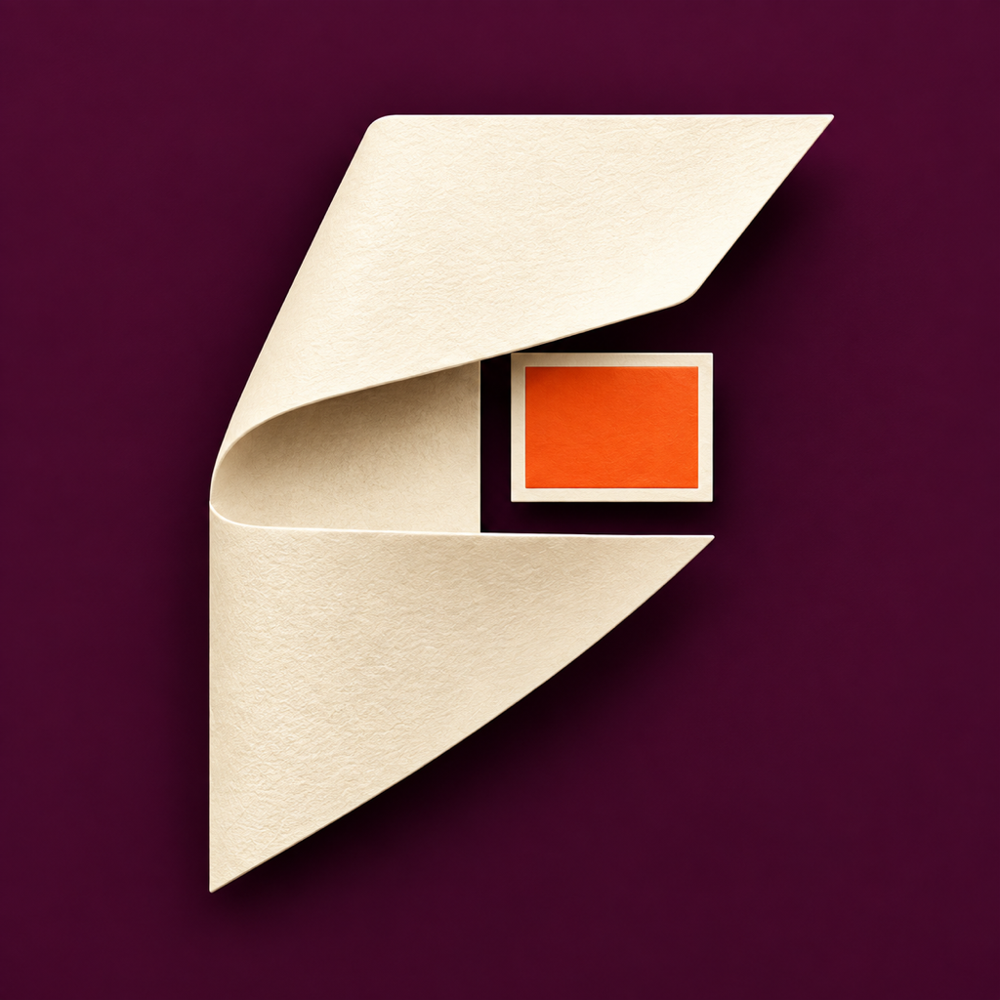
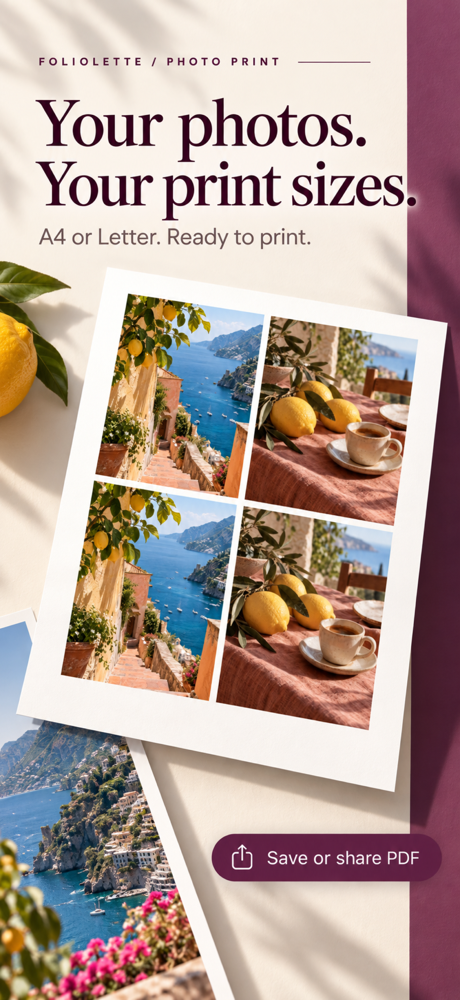
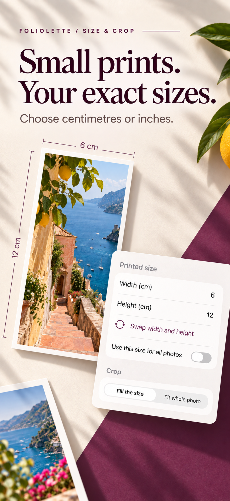
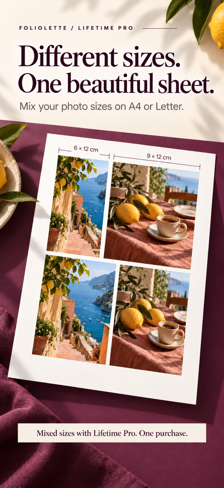
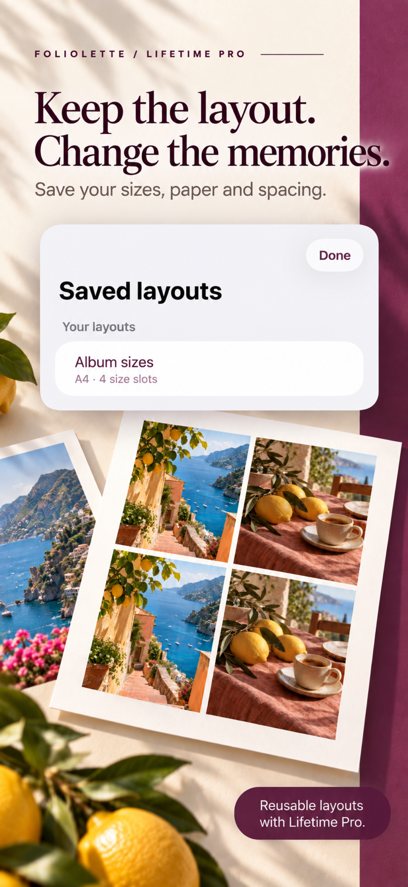
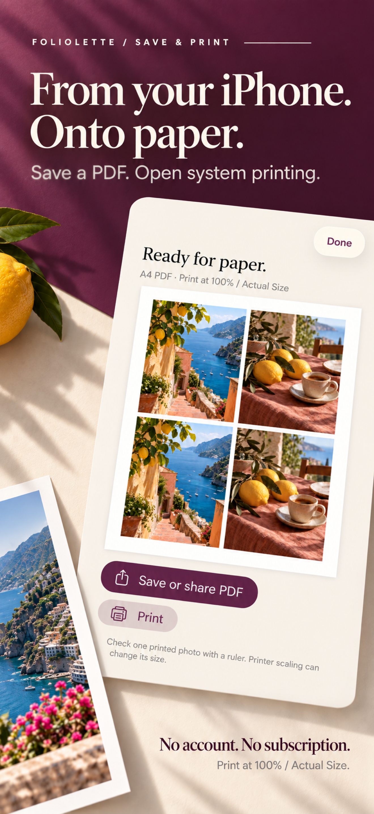

# Foliolette: Print to Size

**Exact Photo Sizes & PDF** · A native iPhone product by [Sepideh Javanbakht Dalir](https://www.arvinify.com).

Choose photo dimensions in centimetres or inches, arrange an A4 or Letter sheet, and export a printable PDF. Built for albums, journals, memory boxes and everyday projects where physical size matters.

**Status: production preparation; not released or submitted to the App Store.** No App Store link is available yet. Physical print measurements, real-device checks, signing and App Store Connect setup remain release gates.

## The product

Many photo projects need several small prints on one page, sometimes at different sizes. Foliolette focuses on a short choose → size → preview → print workflow, with a warm-paper and deep-plum editorial identity.

- Choose photos with Apple's system picker; adjust size and fill/fit crop.
- Preview A4 or Letter with adjustable margins and spacing.
- Export full-quality PDF or use system printing.
- Recover a local draft and reuse photo-free layout templates.
- Free: four uniformly sized photos, PDF export and printing.
- Lifetime Pro: mixed sizes, up to 24 photos when they fit, and saved layouts. One nonconsumable purchase; no subscription.

Printer settings can change physical dimensions. Print at 100% / Actual Size and check a sample with a ruler. No passport-compliance or packing-optimality claim.

## Launch campaign

## Engineering

Swift 6, SwiftUI, Combine observation, PhotosUI, ImageIO, Core Graphics, PDFKit, UIKit printing/sharing and StoreKit 2. Deployment target iOS 15.0, built with Xcode 26.5. No third-party runtime dependencies or backend.

A millimetre-based model drives both preview and PDF placement. Deterministic packing preserves chosen dimensions and rejects overflow. Import bounds resolution and removes source metadata. Atomic, versioned local persistence protects drafts; templates retain dimensions without retaining personal photos. StoreKit grants Pro only from verified entitlements and handles pending approval, restoration, cancellation and revocation.

Validation includes layout boundaries, crop geometry and visible pixels, PDF page boxes, import failures, persistence, purchase states and end-to-end UI. iOS 15 deployment compilation and simulator execution are distinct checks; this development Mac has no iOS 15 runtime. Physical accuracy is not claimed from PDF measurements alone.

## Privacy and product work

Photos stay on the iPhone except when the user shares or prints. No accounts, ads, tracking SDKs or remote analytics. Apple handles purchases; bounded diagnostic event counts stay local. [Privacy](privacy.html) · [Support](support.html).

The project spans product scope and competitor positioning, native UX, implementation, StoreKit tests, branding, ASO and release preparation. Demand and conversion remain unvalidated. Commercial source stays in a private repository; this repository contains public presentation assets only.

© 2026 Sepideh Javanbakht Dalir. All rights reserved. [arvinify.com](https://www.arvinify.com) · [hello@arvinify.com](mailto:hello@arvinify.com)
